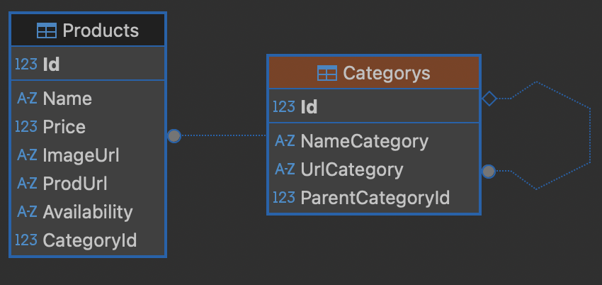

# AptekaPars – C# Парсер для сайта Apteka.ru

**AptekaPars** — автоматизированный парсер, собирающий актуальный список товаров и их цены с сайта **apteka.ru**, сохраняющий данные в базу и предоставляющий API для получения информации по категориям и товарам.

---

## 🔹 Ключевые возможности

- Автоматическое создание и обновление базы данных товаров  
- Структурирование товаров по категориям и подкатегориям  
- Парсинг категорий товаров раз в месяц, товаров — раз в неделю  
- WebAPI для получения данных по:
  - Названию категории
  - Идентификатору категории
  - Названию товара  
- Настройка расписания парсинга через Hangfire

---

## ⚙️ Быстрый старт

1. В `appsettings.json` укажите строку подключения к базе данных в `"DefaultConnection"`  
2. Добавьте данные прокси-серверов при необходимости  
3. Измените расписание парсинга в `Hangfire/HanfireMetods.cs` при необходимости  
4. Запустите проект через `Program.cs`

---

## 📂 Структура проекта

- **Controllers** – контроллеры WebAPI  
- **DataBase** – работа с базой данных  
- **Hangfire** – фоновые задачи для парсинга  
- **Parse** – логика парсинга сайта  
- **Logs** – файлы логов работы парсера  
- **SerialogConfigurator** – конфигурация логирования

---

## 💻 Технологии

- C# 10 / .NET 6  
- Entity Framework Core  
- Hangfire  
- Serilog  
- WebAPI
- AngleSharp

---

## 📈 Примеры запросов к API

- `GET /pars/Apteka/SearchProductsByCategoryIdAsync/{CategoryId}` – получить категорию по ID  
- `GET /pars/Apteka/SearchProductsByCategoryNameAsync/{CategoryName}` – получить категорию по имени 
- `GET /pars/Apteka/SearchProductsByNameProductAsync/{NameProduct}` – получить товар по имени  

---

## Диаграмма БД

## 📫 Связаться со мной

- Telegram: [@errjaan](https://t.me/errjaan)  
- Email: agaev.vili@gmail.com
- Phone: +7(912)-010-09-96
